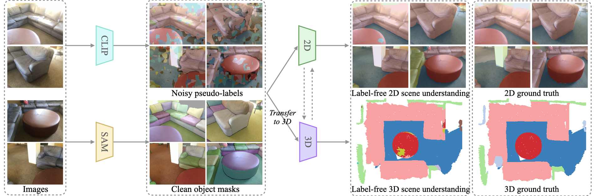
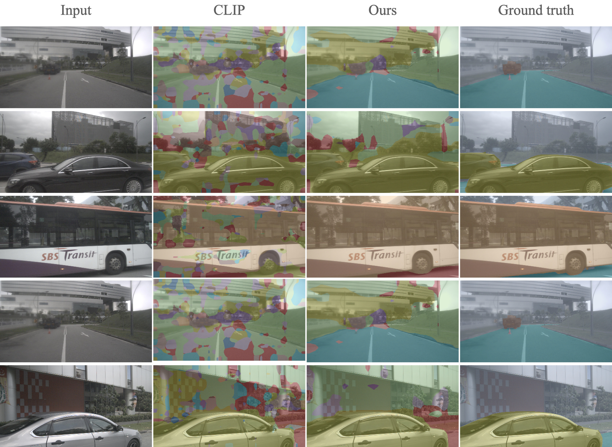

# Towards Label-free Scene Understanding by Vision Foundation Models


We study how vision foundation models enable networks to comprehend 2D and 3D environments without relying on labelled data. To accomplish this, we introduce a novel framework called Cross-modality Noisy Supervision (CNS). By effectively harnessing the strengths of CLIP and
SAM, our approach simultaneously trains 2D and 3D networks, yielding remarkable performance. [[Preprint Paper]](https://arxiv.org/pdf/2306.03899.pdf) 


**scannet 2D.**

**scannet 3D.**

**nuImages.**

**nuScenes 2D.**

**nuScenes 3D.**


The codebase has been adapted from [CLIP2Scene](https://github.com/runnanchen/CLIP2Scene). We will release the code after the paper gets acceptance.

# Citation
```
@article{chen2023clip2scene,
  title={CLIP2Scene: Towards Label-efficient 3D Scene Understanding by CLIP},
  author={Chen, Runnan and Liu, Youquan and Kong, Lingdong and Zhu, Xinge and Ma, Yuexin and Li, Yikang and Hou, Yuenan and Qiao, Yu and Wang, Wenping},
  journal={arXiv preprint arXiv:2301.04926},
  year={2023}
}

@article{chen2023towards,
  title={Towards Label-free Scene Understanding by Vision Foundation Models},
  author={Chen, Runnan and Liu, Youquan and Kong, Lingdong and Chen, Nenglun and Zhu, Xinge and Ma, Yuexin and Tongliang, Liu and Wang, Wenping},
  journal={arXiv preprint arXiv:2306.03899},
  year={2023}
}
```
