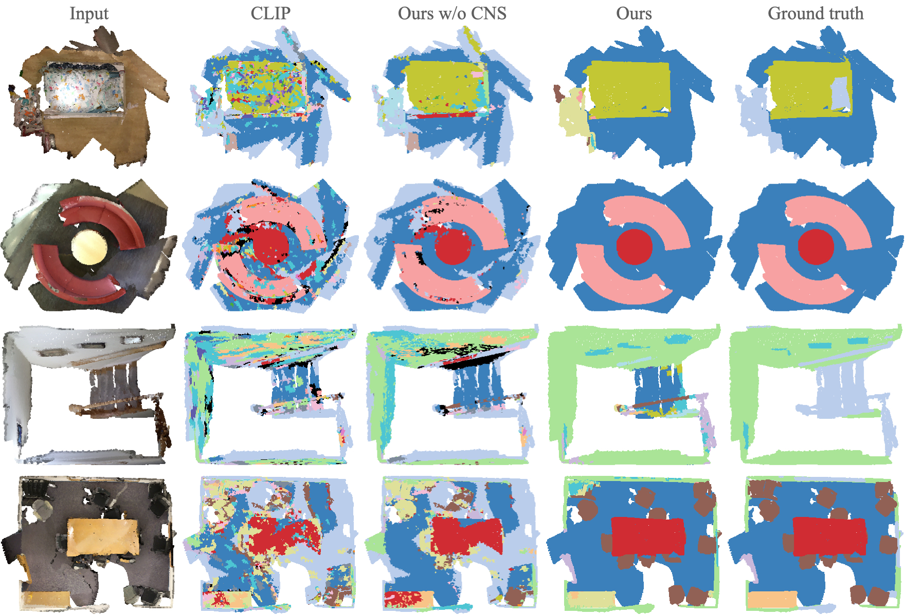

# Towards Label-free Scene Understanding by Vision Foundation Models (NeurIPS 2023)


We study how vision foundation models enable networks to comprehend 2D and 3D environments without relying on labelled data. To accomplish this, we introduce a novel framework called Cross-modality Noisy Supervision (CNS). By effectively harnessing the strengths of CLIP and
SAM, our approach simultaneously trains 2D and 3D networks, yielding remarkable performance. [[Preprint Paper]](https://arxiv.org/pdf/2306.03899.pdf) 

The codebase is adapted from [CLIP2Scene](https://github.com/runnanchen/CLIP2Scene). Codes will be released later this year.

# Qualitative Evaluation 

**scannet 2D.**

**scannet 3D.**

**nuImages.**

**nuScenes 2D.**

**nuScenes 3D.**


# Citation
```
@inproceedings{chen2023clip2scene,
  title={CLIP2Scene: Towards Label-efficient 3D Scene Understanding by CLIP},
  author={Chen, Runnan and Liu, Youquan and Kong, Lingdong and Zhu, Xinge and Ma, Yuexin and Li, Yikang and Hou, Yuenan and Qiao, Yu and Wang, Wenping},
  booktitle={Proceedings of the IEEE/CVF Conference on Computer Vision and Pattern Recognition},
  pages={7020--7030},
  year={2023}
}

@inproceedings{chen2023towards,
  title={Towards label-free scene understanding by vision foundation models},
  author={Chen, Runnan and Liu, Youquan and Kong, Lingdong and Chen, Nenglun and Xinge, ZHU and Ma, Yuexin and Liu, Tongliang and Wang, Wenping},
  booktitle={Thirty-seventh Conference on Neural Information Processing Systems},
  year={2023}
}
```
